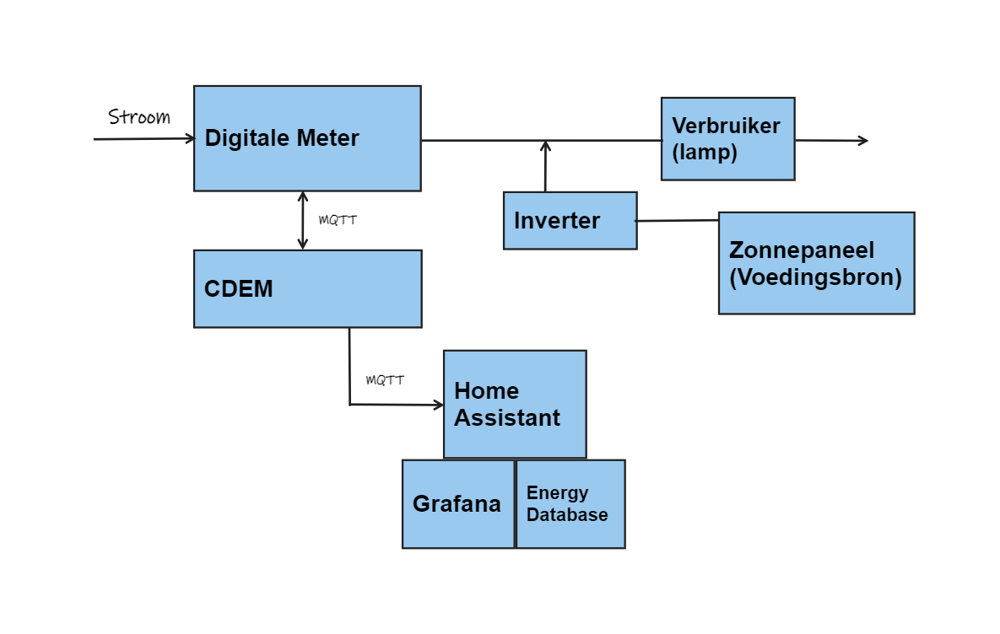
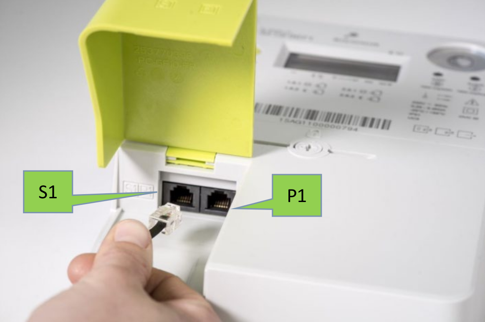
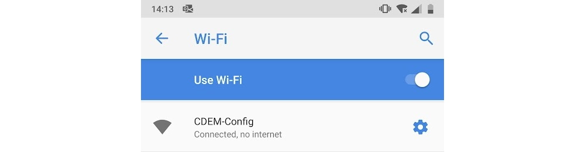
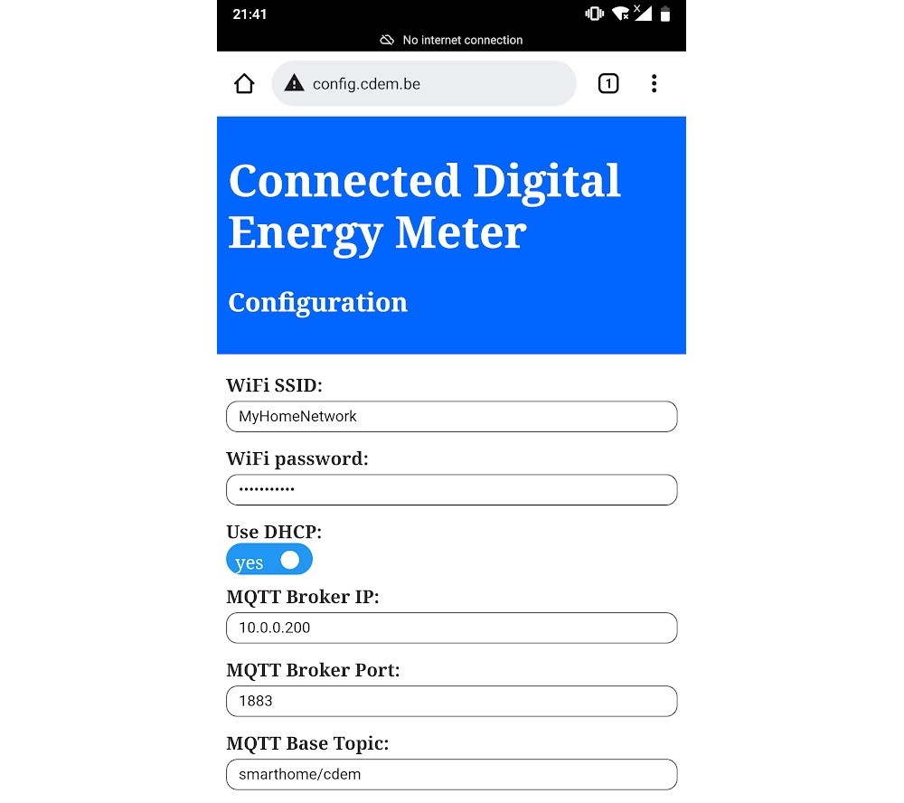

# Dag van de wetenschap

Voor de dag van de wetenschap maken we een opstelling rond energie. Dit door aan de hand van een digitale meter en [CDEM](https://www.cdem.be/). We proberen mensen er van bewust te maken dat de digitale meter geen slimme meter is. Met onze opstelling demonstreren we een interactieve energieopstelling die de eerste stappen bevat naar een écht slimmer energiesysteem.

## Opstelling



# CDEM

## CDEM Aansluiten

### Verbinden

- Het CDEM-apparaat aansluiten op de nutsmeter is uiterst eenvoudig. Het enige dat u nodig hebt, is een 6-aderige RJ12-kabel. Steek de ene kant in de meter en de andere in het CDEM-apparaat. Zodra de gebruikerspoorten van uw digitale meter zijn geactiveerd, kunnen de gegevens van de meter worden opgehaald met het CDEM-apparaat.

### De Fluvius-meterpoort activeren

- Voordat de gegevens van de Fluvius digitale meter kunnen worden uitgelezen, dient men de P1-poort van de meter online te activeren (er is geen monteur nodig). Dit kan door een online activatie aan te vragen op de [Fluvius website](https://www.fluvius.be/nl/thema/meters-en-meterstanden/activeer-desactiveer-je-gebruikerspoorten).

::: tip ⌚ Kan even duren
Het daadwerkelijke activeringsproces van de meter kan tot 72 uur duren . Normaal gesproken zou u een e-mail van Fluvius moeten ontvangen wanneer het proces is voltooid en de poorten beschikbaar zijn
:::

### Aansluiten op de Fluvius-meter

- Sluit aan op de P1-poort van de digitale meter (de rechterhand als u voor de meter staat). De S1-poort werkt niet.



## Uw CDEM configureren

### Toegang tot de configuratiepagina

- Het apparaat kan worden geconfigureerd door verbinding te maken met het toegangspunt dat door het apparaat wordt geleverd bij het opstarten met behulp van een smartphone of computer. Dit toegangspunt is slechts voor een beperkte tijd van 5 minuten beschikbaar . Als de configuratiepagina niet binnen het tijdvenster wordt geopend, start het apparaat op met de huidige configuratie.

### De configuratie wijzigen

Het wijzigen van de apparaatinstellingen kan op elk moment worden gedaan. Het enige wat u hoeft te doen is:

1. Sluit het apparaat aan op een computer of smartphoneadapter.
2. Start het apparaat opnieuw op.
3. Maak verbinding met het toegangspunt `CDEM-Config` met het wachtwoord `smartmeter`.
4. Ga naar de configuratiepagina door een url te openen zoals [config.cdem.be](http://config.cdem.be)
5. Wijzig de configuratie-instellingen.
6. Sla de instellingen op met `Save` of negeer de wijzigingen met `Cancel`.
   



## Home Assistant Grafana Dashboard

### Influxdb

1. add Influxdb on add-on store

```yml
configuration.yml

influxdb:
  host: 192.168.1.131 // IP of  Home Assistant device
  port: 8086
  database: iot_lab
  username: iot
  password: ######
  max_retries: 3
  default_measurement: state
```

### Node Red

1. Install Node-red in Add-on
2. Add node-red-contrib-influxdb

3. Add [Flow](./Node_red/flows.json)

### Grafana

1. Add data Source
2. Choose InfluxDb
3. Add URL : ip of device
4. Choose database
5. user iot
