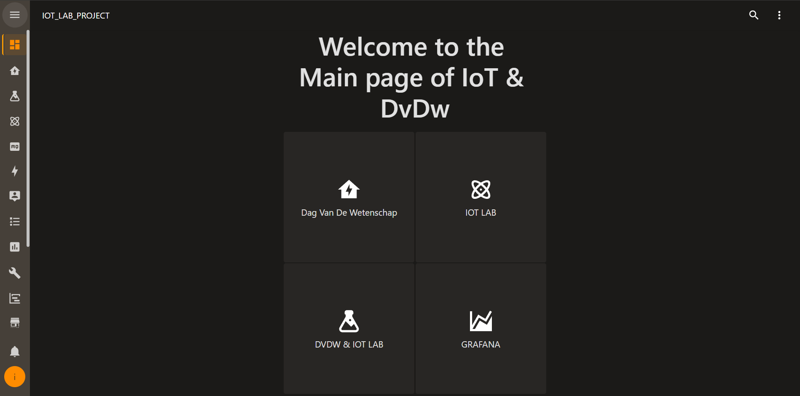
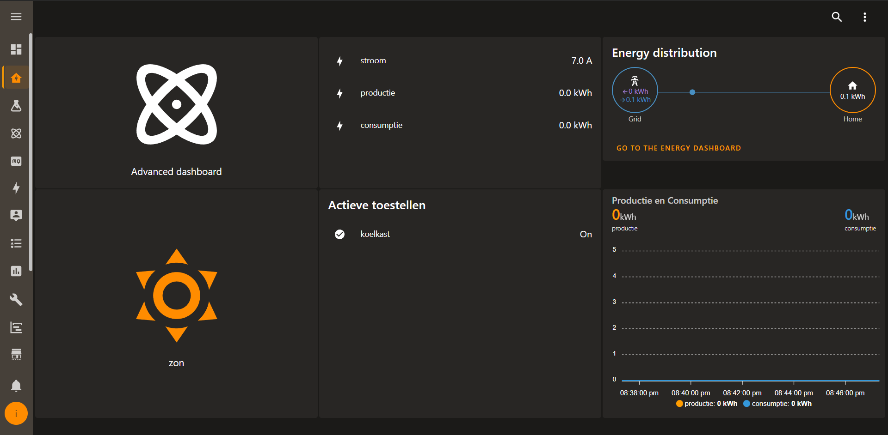
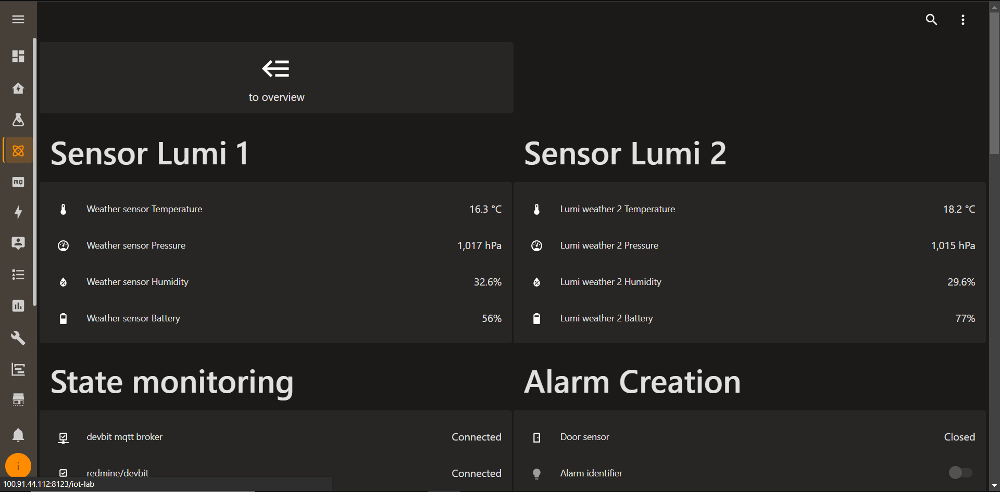
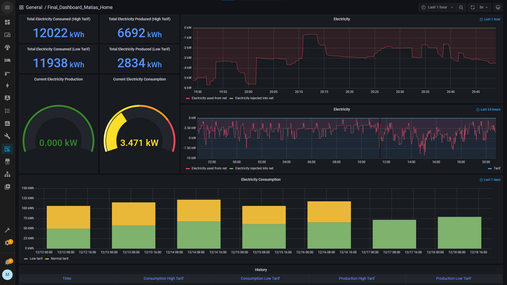

# Iot Lab

## Wat

Het Iot lab is een project dat opgedeeld is uit twee delen. Ten eerste is er het DVDW/Digitale meter gedeelte. Aan de hand van dit deel willen mensen in lichten over hun verbruik. Om dit te doen wordt gebruik gemaakt van de digitale meter, de cdem om data te versturen en home assistant om deze data te verwerken. Voor dit deel wordt voor de productie een dag gesimuleerd aan de hand van een python script.

Het tweede deel is het Iot gedeelte. In dit gedeelte zijn er vooral security gerelateerde zaken uitgewerkt. Zo is er een alarm systeem, een camera systeem en een presence detection systeem. Daarnaast wordt hierin ook nog monitoring van sites en services gedaan. Het alarm systeem is een systeem waarbij een alarm kan uitgezet aan en aangezet worden aan de hand van een nfc tag. Dit alarm gaat af wanneer iemand de deur opendoet terwijl hij het alarm niet heeft uitgezet. Het camera systeem zal hierbij dan een foto nemen en deze via een melding versturen. Daarnaast verstuurt deze camera ook foto's wanneer er niemand in het lokaal hoort te zijn.

## Hoe

Dit project is gerealiseerd op home assistant. Deze home assitant krijgt alle data die hij nodig heeft binnen en kan dan aan de hand hiervan automations gaan uitvoeren. Zo schakelt hij aan de hand van de data van de simulatie van de dag toestellen aan en uit, ook wordt de data van de digitale meter gebruikt in deze automations. Zo worden er bijvoorbeeld bij het drukken van een knop meldingen verstuurd die de huidige consumptie en productie bevatten. Ook de data van de cameras worden gebruikt om snapshot te nemen en via meldingen te versturen.

## Team

- [ Lukas Hoste](https://github.com/LukasHoste)
- [ Matias Vereecke](https://github.com/MatiasVereecke)
- [ Jarno Mechele](https://github.com/JarnoMechele)
- [ Brent Schaepdrijver](https://github.com/Brent-Schaepdrijver)
- [ Maxim Govaert ](https://github.com/Smiley078)
- [ Robin Jonckheere](https://github.com/jonckheereke)

## Installatie

### Home assistant os

1. download raspberry pi imager op de volgende [website](https://www.raspberrypi.com/software/)
2. installeer en start de raspberry pi imager
3. klik op selecteer OS en ga naar Other specific-purpose OS -> Home assistants and home automation -> Home assistant
4. Selecteer afhankelijk van op welke pi je werkt de home assistant versie
5. keer terug en kies als opslagapparaat de sd kaart waarop je home assistant wilt zetten
6. druk op schrijf
7. steek de SD card in je pi
8. sluit een ethernet kabel aan op de pi
9. sluit de power kabel aan
10. Nu kan je op home assistant via het adres homeassistant.local:8123. Als dit niet werkt kan het zijn dat je een adres van de volgende vorm moet gebruiken "http://X.X.X.X:8123"

Het is ook mogelijk om home assistant in een docker container te draaien volg hiervoor de instructies op de volgende [pagina](https://www.home-assistant.io/installation/raspberrypi/#install-home-assistant-container). Voor ons project is het echter logischer om het op een pi te draaien.

### Gebruikte add-ons

1. File editor
   Aan de hand deze add-on kunnen de files van de home assistant aangepast worden. Dit is zeer handig voor het toevoegen van sensoren, services,... aan configuration.yaml en ook om ongebruikte automations aan te passen aan de hand van yaml, deze kunnen namelijk binnen home assistant enkel gevonden worden als ze al getriggered zijn.
2. Grafana en influxDB
   influxDB staat ons toe om een database te gebruiken binnen home assistant die de verschillende waarden die de CDEM opstuurt van de digitale meter op te slaan.
   Aan de hand van Grafana kunnen we dan op een dashboard de huidige consumptie, huidige productie en grafieken van deze waarden tonen.
3. mosquitto broker
   Laat ons toe om een mosquitto broker op de home assistant te laten lopen
4. Node-RED
   Laat ons toe om Node-RED te gebruiken op de home assistant. Dit wordt primair gebruikt om de data die binnenkomt van de cdem op de broker in de database te plaatsen. Het kan echter ook gebruikt worden voor automaties, die binnen home assistant moeilijk te maken zijn.
5. Z-Wave JS
   Laat home assistant toe om aan de hand van een USB-controller met Z-Wave toestellen te communiceren.
6. Tailscale
   Aan de hand van tailscale kan een VPN opgezet worden naar de home assistant pi. Dit hebben wij gebruikt om aan het project te kunnen werken van op afstand.
7. Terminal & SSH
   Laat ons toe om de home assistant te besturen aan de hand van de terminal

### Home assistant integrations

1. google assistant
   De google assistant laat toe om zaken aan te sturen aan de hand van google assistant vanop de gsm, tablet of google home.
2. google calendar
   Laat toe om je google calendar te verbinden met home assistant. De integration voegt de calendar dashboard en calendar entities toe. Aan de hand van deze calendar entities kunne automaties aangemaakt worden.
3. WLED
   WLED is een integration die ons toe laat om NeoPixel aan te sturen.

## Dashboards

|                                               |                                                 |
| :-------------------------------------------: | :---------------------------------------------: |
|  |  |
 |  |
|    |

## Meer uitleg

### Setup van de pi

Hier vind je hoe de setup van de pi waarop alles staat moet gebeuren.
[setup](./Documentation/setup.md)

### Configuratie files gebruiken

Hier vind je hoe je onze configuratie files moet toevoegen aan je eigen home assistant os.
[configuratie files](./Documentation/configuratie.md)

### Dag van de wetenschap

Hier vind je meer uitleg over alles voor de dag van de wetenschap
[DVDW](./Documentation/Dag_Van_De_Wetenschap.md)

### Powersuply script

Een script om aan de hand van mqtt de waarden van een voeding aan te passen. Dit gebeurt met USB aan de hand van SCPI commands.
Aan de hand van het script kan met mqtt de stroom, spanning geregeld worden. Ten laatste kan een sinus gebruikt worden om de stroom te bepalen, op deze manier wordt een dag en nacht cyclus gesimuleerd.

[Powersupply repo documentatie](https://github.com/vives-project-xp/Iot-lab_powersupply_script)

### Configuratie Smart Devices

Hier vind je meer info over de toestellen die we gebruiken in ons project.

[Configuratie Smart-devices](./Documentation/config_smart_devices.md)

### Uitleg home assistant

Hier vind je meer uitleg over de zaken die we binnen home assistant gebruikt hebben. Hier vind je bijvoorbeeld hoe we de verschillende dashboards gemaakt hebben.

[home assistant](./Documentation/hass.md)

### Automaties

Hier vind je een gedetaileerde uitleg over alle gebruikte automaties.

[Automaties](./Documentation/automations.md)
