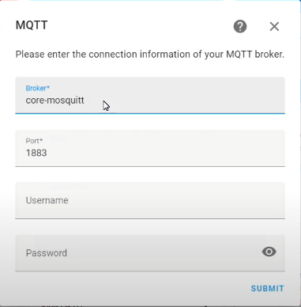

# Iot-Lab

## Wat

Het hoofddoel van dit project is om op een interactieve manier mensen toe te lichten over verbruik.
Een subdoel hierbij is om een lokaal smart te maken, hierin kan het hoofddoel dan verwerkt worden in een home assistant dashboard.
Onder dit subdoel horen presence detection, status monitoring van sites, het tonen van verbruik met leds en tonen van waarden die sensoren uitlezen.
Daarnaast hoort ook het maken van automations bij dit subdoel.

## Hoe

Aan de hand van home assistant zullen we de uitgelezen waarden van de digitale meter weergeven. Deze worden uitgelezen van een mqtt broker.
De presence detection zal gebeuren aan de hand van MAC adressen en ubiquiti access points, de status monitoring aan de hand van pings binnen home assistant en het aansturen van de leds met WLED.
Het maken van de automations gebeurt ook binnen home assistant.

## Dashboard schets (idee)


# Dag van de wetenschap

[DVDW](Dag_Van_De_Wetenschap.md)

## Documentatie

### powersupply script

Een script om aan de hand van mqtt de waarden van een voeding aan te passen. Dit gebeurt met USB aan de hand van SCPI commands.
Aan de hand van het script kan met mqtt de stroom, spanning geregeld worden. Ten laatste kan een sinus gebruikt worden om de stroom te bepalen, op deze manier wordt een soort dag en nacht cyclus gesimuleerd.

[powersupply repo documentatie](https://github.com/vives-project-xp/Iot-lab_powersupply_script)

### Home assistant

#### status monitoring

Status monitoring van services/sites kan binnen home assistant uitgevoerd worden aan de hand van de ping service.
Om een site/service te monitoren voeg je in configuration.yaml een site volgens onderstaande template toe onder binary_sensor.
Om in configuration.yaml te kunnen bewerken moet je de file editor add-on installeren. Ga hiervoor naar instellingen -> add-ons -> add-on store -> official add-ons -> file editor. Selecteer bij het installeren show in sidebar, na het installeren verschijnt de add on nu in de sidebar en kan je configuration.yaml bewerken.
Als er nog geen binary_sensor onderdeel te vinden is in configuration.yaml moet deze nog toegevoegd worden.

```txt
binary_sensor:
  - platform: ping
    host: '{site of service}'
    name: '{naam (zo kan deze entity later makkelijk teruggevonden worden)}'
    count: {aantal pings die verstuurd moeten worden}
    scan_interval: {om de hoeveel seconden worden pings gestuurd}
```


Om nu deze monitoring op je dashboard te tonen ga je naar je dashboard en klik je rechtsboven op de drie bolletjes -> edit dashboard.
Klik op add card en kies entities voeg hier onderaan de te monitoren sites/services hun entities toe
(te vinden aan de hand van de gegeven naam) en zet color icons based on state aan. Indien je ook wil zien wanneer de
sites/services down waren kan je nog een history graph card toevoegen. Voeg hiervoor zoals voor de vorige card de verschillende entities toe.

Het is binnen home assistant ook mogelijk om een notificatie te sturen naar een gsm die verbonden is met de home assistant. Hiervoor moet het apparaat echter wel op
hetzelfde netwerk zitten als de home assistant.
Om een notificatie te sturen wanneer een service down is download je eerst de home assistant app en verbind je met jouw home assistant.
Vervolgens ga je naar instellingen -> automations -> create automation. Klik op add triger -> state en zoek naar de naam van de entity die je eerder aangemaakt hebt.
Selecteer bij From "connected" en bij To "disconnected". Vervolgens klik je op add action -> call service en zoek naar send a notification via mobile app. Hier kan
dan het juiste apparaat geselecteerd worden en een title en message voor de notification gekozen worden. Druk ten laatste op save.

Indien je je niet altijd op het netwerk van de home assistant bevindt kan je ook meldingen sturen via e-mail of whatsapp.
Voor whatsapp kan je de [callmebot](https://www.callmebot.com/blog/whatsapp-text-messages-from-homeassistant/) service gebruiken en voor e-mail de  
[SMTP service](https://www.home-assistant.io/integrations/smtp/).

#### toevoegen van sensoren, switches, ... aan home assistant

#### mqtt

1. mqtt broker binnen home assistant

   1. install Mosquitto broker in add-on store.
   2. Go to settings. People -> users
   3. Add user
   4. Display: mqttuser
   5. username: mqttuser
   6. Password:
   7. Reboot.
   8. Go to devices and configure

   

2. publish vanuit home assistant  
   switch: om een switch toe te voegen die zijn state published naar mqtt moet je volgende code toevoegen aan configuration.yaml

```txt
  name: "{naam van de entity}"
  state_topic: "{topic om naar te publishen}"
  command_topic: "{topic om op te subscriben om updates te ontvangen}"
  qos: {te gebruiken mqqt qos, wij gebruiken 1}
  payload_on: "{wat te versturen wanneer de swith aan is}"
  payload_off: "{wat te versturen wanneer de swith uit is}"
  retain: {wanneer retain true is wordt na subscription onmiddelijk ontvangen wat de huidige state van de switch moet zijn}

mqtt:
    broker: 127.0.0.1
    port: 1883
    client_id: home-assistant
    keepalive: 60
    switch:
      - unique_id: powersupply_switch
        name: "powersupply switch"
        state_topic: "state"
        command_topic: "state"
        payload_on: "on"
        payload_off: "off"
        qos: 1
        retain: true
      - unique_id: current_effect_switch
        name: "current effect switch"
        state_topic: "currentEffect"
        command_topic: "currentEffect"
        qos: 1
        payload_on: "on"
        payload_off: "off"
        retain: true
```

input: om een input te publishen naar mqtt maken we gebruik van de mqtt.publish service, hiervoor moet in automations.yaml een automation toegevoegd worden.
voorbeeld slider

```txt
- id: '1665648904981'
  alias: powersupply current
  description: ''
  trigger:
  - entity_id: input_number.current_slider (de slider waarvan de waarde moet gepublished worden)
    platform: state (wanneer de state veranderd publishen wa de waarde)
  action:
  - service: mqtt.publish
    data:
      payload_template: '{{ states(''input_number.current_slider'') | float }}' (wat we zullen publishen en het type ervan)
      topic: current (naar welke topic het moet gepublished worden)
      retain: false
```

3. subscribe vanuit home assistant

```text
Configuration.yaml

- platform: mqtt
  name: "consumption_low_tarif"
  unit_of_measurement: 'kWh'
  state_topic: "iot/myhome/cdem/consumption_low_tarif"
  unique_id: "consumption_low_tarif"
  value_template: "{{ value|float}}"
  state_class: measurement
  device_class: energy
```

```text
customize.yaml

sensor.consumption_high_tarif:
    last_reset: "1970-01-01T00:00:00+00:00"
sensor.consumption_low_tarif:
    last_reset: "1970-01-01T00:00:00+00:00"

```

### Home assistant dashboards

Voor het maken van onze dashboards hebben we gebruik gemaakt van een aantal add-ons.
Om de add-ons te installeren maken we gebruik van HACS.

1. Ga naar de Add-on store
2. Installeer een SSH add-on, bijvoorbeeld "Terminal & SSH" (Om deze add-ons te zien moet je advanced mode aanzetten in je user profile)
3. Configureer je gekozen add-on volgens de documentatie van de add-on
4. Start de SSH add-on
5. Connecteer met de SSH add-on
6. Run het volgende command

```txt
wget -O - https://get.hacs.xyz | bash -
```

Wanneer HACS geïnstalleerd is komt het in je sidebar. Selecteer het in je sidebar en klik op Frontend voor dashboard/styling add-ons.
Voor onze dashboards hebben we gebruik gemaakt van Mushroom cards, layout-card, card-mod en apexcharts-card.

#### Mushroom cards

Van Mushroom cards hebben we gebruik gemaakt van de grid cards om het plaatsen van cards in de juiste volgorde en in bepaalde kolommen makkelijker te maken.
Hieronder voorbeeld code van een grid card met het resultaat eronder. In dit voorbeeld hebben we twee kolommen waarin telkens cards zitten. In de eerste kolom zit er daarnaast nog een grid card met 3 kolommen om de status van de knoppen van onze verschillende verbruikers te tonen.

```text
square: false
columns: 2
type: grid
cards:
  - square: false
    columns: 1
    type: grid
    cards:
      - type: custom:mushroom-title-card
        title: Dag van de wetenschap
      - type: entities
        entities:
          - entity: switch.powersupply_switch
          - entity: switch.current_effect_switch
          - entity: input_number.voltage_slider
          - entity: input_number.current_slider
        state_color: true
      - type: grid
        cards:
          - type: button
            tap_action:
              action: toggle
            entity: switch.scherm_mat
          - type: button
            tap_action:
              action: toggle
            entity: switch.scherm_mat
          - type: button
            tap_action:
              action: toggle
            entity: switch.scherm_mat
      - type: custom:apexcharts-card
        graph_span: 5m
        update_interval: 2s
        span:
          start: minute
          offset: '-2m'
        header:
          show: true
          title: Stroom
          show_states: true
          colorize_states: true
        series:
          - entity: sensor.currunt
  - square: false
    columns: 1
    type: grid
    cards:
      - type: custom:mushroom-title-card
        title: Iot lab
      - type: entities
        entities:
          - entity: sensor.lumi_lumi_weather_humidity
          - entity: sensor.lumi_lumi_weather_temperature
          - entity: sensor.lumi_lumi_weather_pressure
      - type: history-graph
        entities:
          - entity: binary_sensor.google_test
        title: Google
      - type: history-graph
        entities:
          - entity: binary_sensor.youtube_test
        title: Youtube
```


#### layout-card

Layout-card bied 3 nieuwe view types aan voor ons dashboard: Horizontal, Vertical en Grid. Wij hebben hiervan gebruik gemaakt van grid. Hieronder het verschil tussen de default view type en grid view type van layout-card.


#### apexcharts-card

Apexcharts staat ons toe om mooiere grafieken toe te voegen aan ons dashboard. Persoonlijk hebben wij het gebruikt om een grafiek van de stroom van onze voeding te tonen.


#### themes

Voor onze dashboards hebben we gebruik gemaakt van ... voor onze themes. Deze themes hebben allemaal zowel een light als dark versie.

### Onze dashboards

Om onze dashboards te maken hebben telkens gebruik gemaakt van één grote grid card. Ook staat de view type telkens op grid type van de layout-card add-on.

#### DVDW

Dit is het dashboard dat enkel gebruikt wordt voor dag van de wetenschap.
Het bestaat uit een button naar het DVDW & Iot_lab dashboard. Deze button kan gebruikt worden moest er op de dag van de wetenschap meer controle nodig zijn over de voeding. Zo kunnen we hier bijvoorbeeld wel de voeding manueel aan en uit zetten, het sinus effect uitzetten en de spanning en stroom regelen. Ten tweede wordt er op het dashboard getoond wat de huidige stroom van de voeding is, de huidige productie en de huidige consumptie. Daarnaast is er een weergave van alle actieve toestellen, dit zijn de toestellen die we simuleren aan de hand van onze bouwlampen (bv. koffiezet, broodrooster,...). Daarnaast staat er een energy card op, ""momenteel zijn er hier echter nog problemen mee."" Ten laatste bevindt er zich op dit dashboard een icon/card die toont of het in de simulatie van de dag met de sinus dag of nacht is.


1. Navigation button
Een button zonder entity met een navigate tap_action naar de gewenste pagina/dashboard.

```yaml
show_name: true
show_icon: true
type: button
tap_action:
  action: navigate
  navigation_path: ../clean-dashboard
name: Advanced dashboard
icon: mdi:atom
```

2. productie, consumptie en stroom card
Dit is een simpele entities card waaraan alle gewenste entities toegevoegd zijn.

```yaml
type: entities
entities:
  - entity: sensor.currunt
    name: stroom
  - entity: sensor.l1_power_production
    name: productie
    icon: mdi:lightning-bolt
  - entity: sensor.l1_power_consumption
    name: consumptie
    icon: mdi:lightning-bolt
```

3. energy card
Dit is een card die linkt naar het energy dashboard.

```yaml
title: Energy distribution
type: energy-distribution
link_dashboard: 'true'
```

4. Actieve toestellen

!!!!  
NOG ONDER DEVELOPMENT  
!!!!  

5. Card die dag of nacht toont aan de hand van een icon

!!!!  
NOG ONDER DEVELOPMENT  
!!!!  

#### DVDW & IOT_LAB

Dit dashboard bestaat uit twee kolommen, één voor DVDW en één voor alles IOT_LAB.
De eerste kolom is deze voor DVDW deze verschilt van het DVDW doordat er zoals eerder verteld meer controle is over de voeding, daarnaast worden er ook meer gegevens getoond zoals een grafiek van de stroom van de voeding. In beide kolommen bevindt er zich eerst een titel, maar bij de kolom van DVDW staat er hiernaast ook nog een button die gaat naar het DVDW dashboard. Deze button is bedoeld als een back button, deze kan namelijk gebruikt worden als er op DVDW meer controle over de voeding nodig was en we daarna terug willen naar het simpelere dashboard. Vervolgens staat er een card waarmee de voeding kan bestuurd worden deze kan uitgezet worden, de stroom en spanning kan aangepast worden en het sinus effect kan aan en uitgezet worden. Hierna is er een card waarmee we de verschillende bouwlampen kunnen aan en uit zetten. Ten laatste staat er een grafiek die de verandering van de stroom volgt.

In de IOT_LAB kolom bevindt er zich eerst een card die de waarden van de verschillende weather sensors toont. Het toont de vochtigheid, druk en temperatuur van het lokaal. Vervolgens zijn er een aantal cards die de state van de verschillende sites/services tonen. Ten laatste is er nog een card die de status van de door sensor toont.


1. back button
Button die terugkeert naar het DVDW dashboard.

```yaml
show_name: true
show_icon: true
type: button
tap_action:
  action: navigate
  navigation_path: ../publish-values
icon: mdi:backburger
icon_height: 50px # icon height om ervoor te zorgen dat de button niet te groot wordt
```

2. card voor aansturing van de voeding
Met deze card kan de voeding aangestuurd worden, dit is gewoon een simpele entities card met al de gebruikte entities. 

```yaml
type: entities
entities:
  - entity: switch.powersupply_switch
  - entity: switch.current_effect_switch
  - entity: input_number.voltage_slider
  - entity: input_number.current_slider
state_color: true
```

3. grid card om de bouwlampen aan te sturen
Om de verschillende buttons mooi naast elkaar te krijgen hebben we gebruik gemaakt van een grid. 

```yaml
type: grid
cards:
  - show_name: true
    show_icon: true
    type: button
    tap_action:
      action: toggle
    entity: switch.lumi_lumi_plug_maeu01_switch
  - show_name: true
    show_icon: true
    type: button
    tap_action:
      action: toggle
    entity: switch.bouwlamp2_plug_3
  - show_name: true
    show_icon: true
    type: button
    tap_action:
      action: toggle
    entity: switch.dvdw_plug3
```

4. grafiek stroom
Voor de grafiek van de stroom hebben we gebruik gemaakt van een apexcharts-card.
Deze card werkt niet perfect, maar is momenteel de beste oplossing die we gevonden hebben.

```yaml
type: custom:apexcharts-card
graph_span: 10m
update_interval: 2s
span:
  start: minute
  offset: '-5m'
header:
  show: true
  title: Stroom
  show_states: true
  colorize_states: true
series:
  - entity: sensor.currunt
```

5. weather sensor card
Een card die alle waarden van de weather sensor toont, dit is een simpele entities card.

```yaml
type: entities
entities:
  - entity: sensor.lumi_lumi_weather_humidity
  - entity: sensor.lumi_lumi_weather_temperature
  - entity: sensor.lumi_lumi_weather_pressure
```

6. state monitoring cards
Dit zijn history graph cards die tonen wanneer een service down was en wanneer up.

```yaml
type: history-graph
entities:
  - entity: binary_sensor.redmine_devbit
title: Redmine/project.devbit
```

7. door sensor entity card
Dit is een simpele entity card die de status van de door sensor toont.

```yaml
type: entity
entity: binary_sensor.lumi_lumi_sensor_magnet_aq2_opening
```


## Home Assistant Grafana Dashboard

### Influxdb

1. add Influxdb on add-on store

```yml
configuration.yml

influxdb:
  host: 192.168.1.131 // IP of  Home Assistant device
  port: 8086
  database: iot_lab
  username: iot
  password: ######
  max_retries: 3
  default_measurement: state
```

### Node Red

1. Install Node-red in Add-on
2. Add node-red-contrib-influxdb

3. Add [Flow](./Node_red/flows.json)

### Grafana

1. Add data Source
2. Choose InfluxDb
3. Add URL : ip of device
4. Choose database
5. user iot
