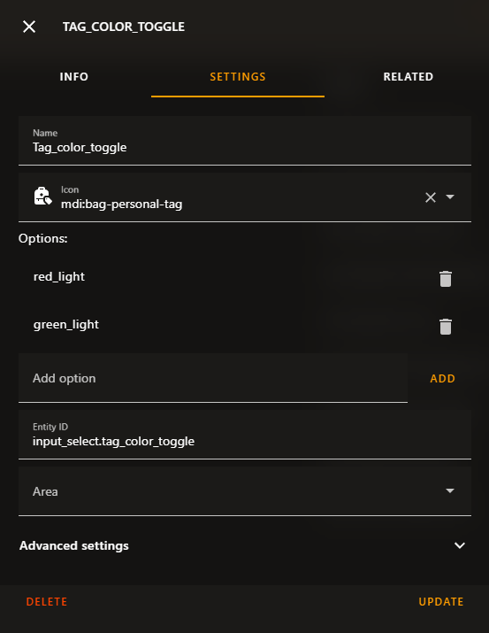

# Onze gebruikte automaties

## Security

1. Snapshot nemen wanneer er niemand in een lokaal hoort te zijn, maar er toch motion is.

Voor deze automatie wordt gebruik gemaakt van google calendar en een motion sensor om een snapshot te sturen via een melding. We doen dit voor security er kan zo niemand zich in de klas bevinden wanneer er geen les is. Een mogelijke uitbreiding hierbij is om ervoor te zorgen dat dit niet gebeurt wanneer ons "alarm" uitgezet is.

```yaml
alias: send snapshot when motion and calendar event
description: ""
trigger:
  - platform: state
    entity_id:
      - binary_sensor.motion_sensor_home_security_motion_detection
    from: "off"
    to: "on"
    enabled: true
condition:
  - condition: state
    entity_id: calendar.timeedit_bxh_a308_labo_elektronica_24p_cbru_0_20221101
    state: "off"
action:
  - service: camera.snapshot
    target:
      entity_id: camera.192_168_1_138
    data:
      filename: /media/camera/camera1.png
  - delay:
      hours: 0
      minutes: 0
      seconds: 2
      milliseconds: 0
  - service: notify.mobile_app_sm_a528b
    data:
      title: Camera 1
      message: Camera 1
      data:
        image: /media/local/camera/camera1.png
```

- trigger: In het trigger gedeelte kijken we of de state van de fibaro motion sensor van off naar on gaat. Hier staat off voor clear/geen motion detected en on voor motion detected.
- condition: In de condition controler of er op dit moment geen les is in het lokaal. We willen namelijk enkel een snapshot nemen en versturen wanneer er geen les hoort te zijn en dus ook geen motion.
- action: In het action gedeelte voeren we meerdere actions uit. Ten eerste wordt er een foto genomen door de geselecteerde camera en wordt deze opgeslagen. Hierna wachten we enkele seconden, om daarna de genomen foto te versturen in een melding naar de home assistant app.

2. Aan en uitzetten van alarm aan de hand van NFC tag.

Aan de hand van de volgende automaties wordt het alarm aan en uitgezet bij het scannen van een NFC tag. Wanneer deze tag gescanned wordt, zal ook een snapshot genomen worden die opgestuurd wordt naar de home assistant app. Deze automatisatie cycled door de helper die is aangemaakt met 2 options.



```yaml
alias: Cycle RGB lights
description: ""
trigger:
  - platform: tag
    tag_id: 41094dc2-da31-4a49-8f0e-50ad6d08a20e
condition: []
action:
  - service: input_select.select_next
    data: {}
    target:
      entity_id: input_select.tag_color_toggle
  - service: camera.snapshot
    target:
      entity_id: camera.192_168_1_138
    data:
      filename: /media/camera/camera1.png
  - delay:
      hours: 0
      minutes: 0
      seconds: 2
      milliseconds: 0
  - service: notify.mobile_app_sm_a528b
    data:
      title: Camera 1
      message: Camera 1
      data:
        image: /media/local/camera/camera1.png

```

- trigger: De trigger van deze automatie is wanneer een gespecifieerde NFC tag gescanned wordt.
- actions: Ten eerste cyclen we door een input_select helper deze helper triggered onderstaande automaties die ervoor zorgen dat de lichten van kleur veranderen. Vervolgens voeren we dezelfde actions uit zoals hierboven uitgelegd om een snapshot te nemen en te versturen.

```yaml
alias: lights red
description: ""
trigger:
  - platform: state
    entity_id:
      - input_select.tag_color_toggle
    to: red_light
condition: []
action:
  - service: input_boolean.turn_on
    data: {}
    target:
      entity_id: input_boolean.alarm_state
  - service: script.light_go_red
    entity_id: light.lamp1
```

```yaml
alias: lights green
description: ""
trigger:
  - platform: state
    entity_id:
      - input_select.tag_color_toggle
    to: green_light
condition: []
action:
  - service: input_boolean.turn_off
    data: {}
    target:
      entity_id: input_boolean.alarm_state
  - service: script.cycle_rgb_lights
    data: {}
```

- trigger: De trigger van deze automatie is wanneer de tag_color_toggle input_select helper verandert naar red_light.
- actions: Ten eerste zetten we de input_boolean die de state van ons alarm aantoont op on. Hierna wordt een script gerunt die de lamp op rood zet. Het script wordt hieronder uitgelegd

Dit script zal ervoor zorgen dat de lamp rood wordt (dashboard lamp 1). Hiervoor wordt er een service opgemaakt die de lamp aansteekt met het bepaald kleur (bv: rood zoals hieronder). Ook wordt er gestuurd via een whatsapp notificatie als het alarm aan of uit is. Vervolgens wordt de google hub aangestuurd en wordt er bijvoorbeeld gezegd: "Alarm is on". Hiervoor wordt er een media player service opgesteld, een delay aan toegevoegd van 4 seconden (zodat de text-to-speech niet blokkeert) en dan de media player uitzetten als laatste. Hetzelfde bij de "light go green"-script.

```yaml
alias: light go red
sequence:
  - service: light.turn_on
    data:
      rgb_color:
        - 255
        - 0
        - 0
    target:
      entity_id: light.dashboard_lamp_1
  - service: input_select.select_first
    data: {}
    target:
      entity_id: input_select.tag_color_toggle
  - service: notify.whatsapp_message_phone1
    data:
      message: The alarm is turned on.
      title: ALARM
  - service: media_player.play_media
    target:
      entity_id: media_player.nesthub0c4d
    data:
      media_content_id: media-source://tts/google_translate?message=The+alarm+is+on
      media_content_type: provider
    metadata:
      title: The alarm is on
      thumbnail: https://brands.home-assistant.io/_/google_translate/logo.png
      media_class: app
      children_media_class: null
      navigateIds:
        - {}
        - media_content_type: app
          media_content_id: media-source://tts
        - media_content_type: provider
          media_content_id: media-source://tts/google_translate?message=The+alarm+is+on
  - delay:
      hours: 0
      minutes: 0
      seconds: 4
      milliseconds: 0
  - service: media_player.turn_off
    data: {}
    target:
      device_id: 0300c8ca212177a3923003f6cceb9dbd
mode: single
```

3. lichten van kleur veranderen afhankelijk van of het nacht of dag is in de simulatie van een dag

```yaml
alias: Night/Day toggle
description: ""
trigger:
  - platform: state
    entity_id:
      - switch.powersupply_switch
    from: "on"
    to: "off"
    id: night
  - platform: state
    entity_id:
      - switch.powersupply_switch
    id: day
    from: "off"
    to: "on"
condition: []
action:
  - service: light.turn_on
    data:
      rgb_color:
        - 139
        - 215
        - 253
    target:
      entity_id:
        - light.dashboard_lamp_3
  - choose:
      - conditions:
          - condition: trigger
            id: night
        sequence:
          - service: light.turn_on
            data:
              rgb_color:
                - 139
                - 215
                - 253
            target:
              entity_id:
                - light.dashboard_lamp_3
      - conditions:
          - condition: trigger
            id: day
        sequence:
          - service: light.turn_on
            data:
              rgb_color:
                - 255
                - 174
                - 0
            target:
              entity_id:
                - light.dashboard_lamp_3
mode: single
```

- triggers: In deze automatie maken we gebruik van trigger ID's om een onderscheide te maken tussen verschillende triggers en dan andere actions uit te gaan voeren. We hebben hier twee triggers wanneer de switch van off naar on gaat en het dus dag wordt en wanneer de switch van on naar off gaat en het dus nacht wordt.
- action: In onze action zetten we eerst de lamp aan om vervolgens een choose action te gebruiken. Hierin kan aan de hand van ons entity ID gekozen worden welke action uitgevoerd moet worden. Wanneer de id night zetten we de lamp op een wit/lichtblauwe kleur en wanneer de ID day is op een oranje kleur.

4. Aan en uitzetten van koelkast afhankelijk van state van simulatie dag

```yaml
alias: koelkast(on/off)
description: ""
trigger:
  - platform: state
    entity_id:
      - switch.powersupply_switch
    id: psu_off
    from: "on"
    to: "off"
  - platform: state
    entity_id:
      - switch.powersupply_switch
    from: "off"
    to: "on"
    id: psu_on
condition: []
action:
  - choose:
      - conditions:
          - condition: trigger
            id: psu_off
        sequence:
          - type: turn_off
            device_id: 810484b76179e181971fced662893273
            entity_id: switch.lumi_lumi_plug_maeu01_switch
            domain: switch
      - conditions:
          - condition: trigger
            id: psu_on
        sequence:
          - type: turn_on
            device_id: 810484b76179e181971fced662893273
            entity_id: switch.lumi_lumi_plug_maeu01_switch
            domain: switch
mode: single
```

- trigger: We hebben voor deze automatie opnieuw twee triggers met elk een trigger ID. Het is hier opnieuw of de switch van de dag simulatie van off naar on gaat en van on naar off.
- action: In de action wordt afhankelijk van de trigger ID's van de triggers gekozen om de switch van de koelkast aan of uit te zetten.

5. Zpparaat aanzetten met een actionable notification

```yaml
alias: Actionable bouwlamp 2_test
description: ""
trigger:
  - platform: device
    device_id: 694d768c2536b86d13ea2abe505c6313
    domain: zwave_js
    type: event.value_notification.central_scene
    property: scene
    property_key: "001"
    endpoint: 0
    command_class: 91
    subtype: Endpoint 0 Scene 001
condition: []
action:
  - service: script.actionable_notification_turn_on_device
    data:
      deviceName: boiler
mode: single
```

- trigger: De trigger van deze automation is de push van een button
- action: Als action wordt een script uitgevoerd die een actionable notification stuurt en wordt als data de naam van het device meegestuurd.

```yaml
alias: Actionable notification (turn on device ??)
sequence:
  - service: notify.ALL_DEVICES
    data:
      message: >-
        Do you want to turn on or off the {{ deviceName }} 

        production/consumption = ( {{ states('sensor.l1_power_production') }} kW
        / {{ states('sensor.l1_power_consumption') }} kW) 

        gemiddeld verbruik = 500W
      title: "{{deviceName}}"
      data:
        actions:
          - action: TURN_ON_{{deviceName}}
            title: Turn on the device
          - action: TURN_OFF_{{deviceName}}
            title: Turn off device
mode: single
```

Het script dat door de automatie gerunt wordt stuurt een actionable notification naar de home assistant app met twee buttons. Wanneer op deze buttons gedrukt wordt zal de action met de naam TURN_ON_deviceName (bv. boiler) of TURN_OFF_deviceName uitgevoerd worden. Momenteel is hier nog het verbruik hardcoded, maar het zou de bedoeling zijn om ook dit als argument mee te geven aan het script.

Vervolgens hebben we nog een automation die de verschillende actions van onze actionable notifcation handled.

```yaml
alias: actions from actionable notification
description: ""
trigger:
  - platform: event
    event_type: mobile_app_notification_action
    event_data:
      action: TURN_ON_boiler
    id: turn_on_device
  - platform: event
    event_type: mobile_app_notification_action
    id: turn_off_device
    event_data:
      action: TURN_OFF_boiler
condition: []
action:
  - type: toggle
    device_id: db6d7e69c52288cebd3673f3a21be0cf
    entity_id: switch.bouwlamp2_plug_3
    domain: switch
    enabled: false
  - choose:
      - conditions:
          - condition: trigger
            id: turn_on_device
        sequence:
          - type: turn_on
            device_id: db6d7e69c52288cebd3673f3a21be0cf
            entity_id: switch.bouwlamp2_plug_3
            domain: switch
      - conditions:
          - condition: trigger
            id: turn_off_device
        sequence:
          - type: turn_off
            device_id: db6d7e69c52288cebd3673f3a21be0cf
            entity_id: switch.bouwlamp2_plug_3
            domain: switch
mode: single
```

- trigger: De triggers van deze automatie gebeuren wanneer een mobile_app_notification_action ontvangen wordt. Deze triggers hebben een trigger ID om bij action een geschikte action te kunnen kiezen.
- action: Als actions wordt afhankelijk van het trigger ID een switch aan of uit gezet.
