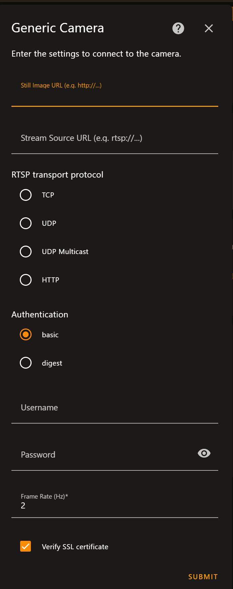

# Configuratie en info voor de Smart-toestellen

## Phillips Hue Remote 

Dit is de remote controller die kan worden gebruikt voor de lampen te dimmen of ook voor andere automatisaties die dan kan worden geconfigureerd in de home assistant. 

Om deze te configureren in de home assistant, moet je deze stappen volgen: 

<ol>
  <li>Ga naar de settings op de home assistant en zoek voor de optie **Devices & Services**</li>
  <li>Selecteer de **Add integration**</li>
  <li>Deze zal dan automatisch moeten tevoorschijn komen in de lijst als **Phillips Hue**</li>
</ol>

De informatie is [hier teruggevonden](https://www.home-assistant.io/integrations/hue/).

## Shelly Plug WIFI

Dit zijn **smart wifi plugs** die we kunnen gebruiken om de monitors aan/-uit te doen of een automatisatie aan toevoegen, zodat een monitor na een bepaalde tijd terug uitgaat. 

Deze gaan configuren kan je [hier de informatie gaan terugvinden](https://www.home-assistant.io/integrations/shelly/). 

## Conbee 2 Deconz Zigbee Usb

Dit is de USB-dongle die gebruikt wordt om de communicatie te maken tussen de home assistant en de zigbee-toestellen.

Deze informatie om te configureren, is [hier terug te vinden](https://www.phoscon.de/en/conbee2)

## Z-Stick Gen5+

Deze Z-wave controller wordt gebruikt om communicatie te maken met de Z-wave (plus) apparaten. 

Dit wordt verbonden met onze RPI4, aan een aparte USB-dongle. Dit moet worden geconfigureerd binnen in de home-assistant zelf. Hiervoor zal je moeten gaan naar de **Store** in de home assistant zelf en zal je eerst moeten access krijgen naar de community store. Om deze te krijgen moet je deze [GIT_REPO](https://github.com/hassio-addons/repository) importen in de store zelf. Dan daarna is het mogelijk om de **Z-wave JS** te gaan installen. **Het kan zijn dat je de Home-Assistant moet gaan rebooten.**

Voor verder configuraties met de home-assistant, kan je [hier terugvinden](https://aeotec.freshdesk.com/support/solutions/articles/6000246297-setup-home-assistant-with-z-stick-gen5-) of met [deze video](https://www.youtube.com/watch?v=62uhVq_76K8&ab_channel=JuanMTech).

## Z-Wave Push button

Deze buttons worden geconnecteerd met de **Z-stick Gen5**. Deze worden gebruikt voor bij de DVDW, om bijvoorbeeld één van onze bouwlampen te laten aangaan / uit. (Die verbinding wordt dan ook gelegd met een "slim-stopcontact"). 

Als er problemen zijn met deze push buttons terug te vinden in de Home Assitant, is het beste om te doen ze eerst gaan resetten.

<ol>
  <li>Hiervoor zal je dus moeten 5x klikken en ook inhouden voor ongeveer 5 seconden op de button zodat het in de reset modus terecht komt.</li>
  <li>Na het resetten van de button kan je hem gaan connecten.</li>
</ol>

Voor het connecten, kan het zijn dat je de connecting op een **non-secure** moet plaatsen. (Dit zal op je scherm komen als je een device wilt gaan toevoegen).

<ol>
  <li>Om hem te connecten moet je de button 6x klikken (minstens) en dan even wachten en zal het moeten verschijnen tussen de devices om te connecten.</li>
</ol>

Deze informatie is [hier teruggevonden](https://manuals.fibaro.com/content/manuals/en/FGPB-101/FGPB-101-EN-T-v1.2.pdf) op **pagina 5-6**.

## Door and window sensor (Aqara)

Dit Zigbee-toestel kan worden gebruikt voor een automatisatie met een alarm bijvoorbeeld of ook om een notificatie door te geven dat de deur of raam nog open staat. 

Om deze te gaan configureren kan het ook zijn dat hij niet tevoorschijn komt tussen de devices. Hiervoor zal je het moeten gaan resetten. Dit gebeurt ook op dezelfde knop om hem te gaan connecten.

<ol>
  <li>Resetten kan je doen door ongeveer 3 seconden op de button te duwen.</li>
  <li>Daarna zal je het moeten kunnen connecten door een 1x erop te klikken die je dan terug tussen de devices zal kunnen terugvinden.</li>
</ol>

Voor nog verder informatie over de deur/raam sensor, kan je [hier gaan terugvinden](https://cdn.aqara.com/cdn/website/mainland/static/docs/Door-and-Window-Sensor_Manuals_EU.pdf).

## Vibration sensor (Aqara)

Dit is een vibratie sensor die kan beweging kan detecteren, om bijvoorbeeld te gaan weten als er iemand in het lokaal zou zijn. 

Om deze te gaan configureren kan het ook zijn dat hij niet tevoorschijn komt tussen de devices. Hiervoor zal je het moeten gaan resetten. Dit gebeurt ook op dezelfde knop om hem te gaan connecten.

<ol>
  <li>Resetten kan je doen door ongeveer 5 seconden op de button te duwen.</li>
  <li>Daarna zal je het moeten kunnen connecten door een 1x erop te klikken die je dan terug tussen de devices zal kunnen terugvinden.</li>
</ol>

Voor nog verder informatie over de vibratie sensor, kan je [hier gaan terugvinden](https://cdn.aqara.com/cdn/website/mainland/static/docs/Vibration-Sensor_Manuals_EU.pdf).

## Temperature / Humidity sensor (Aqara)

Dit is een temperatuur / humidity sensor. Hiervoor kunnen we bijvoorbeeld zien hoe warm het is in het lokaal of de luchtvochtigheid nagaan. 

Om deze te gaan configureren kan het ook zijn dat hij niet tevoorschijn komt tussen de devices. Hiervoor zal je het moeten gaan resetten. Dit gebeurt ook op dezelfde knop om hem te gaan connecten.

<ol>
  <li>Resetten kan je doen door ongeveer 5 seconden op de button te duwen.</li>
  <li>Daarna zal je het moeten kunnen connecten door een 1x erop te klikken die je dan terug tussen de devices zal kunnen terugvinden.</li>
</ol>

Voor nog verder informatie over de temperatuur / luchtvochtigheid sensor, kan je [hier gaan terugvinden](https://cdn.aqara.com/cdn/website/mainland/static/docs/Temperature-and-Humidity-Sensor_Manuals_EU.pdf).

## Smart plug (Aqara)

Dit is een smart plug met Zigbee. Deze kan ook worden gebruikt om een lamp aan/-uitdoen of deze te gaan koppelen aan een automatisatie. 

Om deze te gaan configureren kan het ook zijn dat hij niet tevoorschijn komt tussen de devices. Hiervoor zal je het moeten gaan resetten. Dit gebeurt ook op dezelfde knop om hem te gaan connecten.

<ol>
  <li>Resetten kan je doen door ongeveer 5 seconden op de button te duwen.</li>
  <li>Daarna zal je het moeten kunnen connecten door een 1x erop te klikken die je dan terug tussen de devices zal kunnen terugvinden.</li>
</ol>

Voor nog verder informatie over de smart plug, kan je [hier gaan terugvinden](https://www.plugwise.com/product/aqara-plug-2/).

## RGB-Lampen (Tuya IoT Platform)

De lampen kunnen geconnecteerd worden a.h.d.v. 2,4GHz wifi. Deze kunnen gebruikt worden om bijvoorbeeld aan te tonen dat het alarm aanstaat door een rood kleur te weergeven. 

De configuratie van deze lampen, moet je gaan gebruik maken van het **Tuya IoT Platform**. Hiervoor zal je:

<ol>
  <li>Eerst de app moeten downloaden op je smartphone. </li>
  <li>Daarna een account creëren op het platform. <em>Hiervoor werd een mail gebruikt die we ook kunnen gebruiken voor andere zaken rond het project. Dit is : "iotlab.vives@gmail.com" met wachtwoord: " "</em></li>
</ol>

Daarna kan je de rest van de instructies gaan volgen via [deze link](https://www.home-assistant.io/integrations/tuya/). Deze link is om [een account creëren/inloggen](https://auth.tuya.com/?from=http%3A%2F%2Fiot.tuya.com%2Fcloud%2Fbasic%3Fid%3Dp1668689825809xxqusn%26region%3DEU%26toptab%3Dapplication%26authorizeTab%3D0) en de [app](https://developer.tuya.com/en/docs/iot/tuya-smart-app-smart-life-app-advantages?id=K989rqa49rluq#title-1-Download).

### Local Tuya

De lampen nu zijn nog anders geconnecteerd. Hierbij worden nu de lokale keys gebruikt om met de lampen te connecteren. Hier vind je [extra informatie](https://github.com/rospogrigio/localtuya).

Om de lokale keys van de lampen te verkrijgen moet je het volgende doen:

1. Op de tuya iot platform gaan en daar gaan naar API calls, en zoeken naar "Smart Home Device Management" of device management. Daarin zal je een GET-request kunnen doen van **device information**.

2. In die call zal je dan de device ID moeten ingeven. Deze zijn ook terug te vinden op het iot platform zelf.

3. Hierbij zal je de lokale key verkrijgen die je zult nodig hebben om de lampen te gaan verbinden.

Bij het toevoegen van deze lampen, zal je verschillende opties moeten invullen en dit is niet gelijk wat je invult, dus [kijk hier wat je moet invullen/aanpassen.](https://community.home-assistant.io/t/tuya-bulb-wont-go-rgb-after-being-set-to-white/373436/2)

## IP Camera

De camera wordt eerst aangesloten aan de router en voeding. We open de eWeLink app. We maken een login account en klikken op add devices. Eenmaal de devices zijn toegevoegd kunnnen we deze integreren in Home assistant.

In home assistant  kunnen we kiezen voor de eWinLink  addon of voor general camera. Bij deze kiezen we voor general camera. Hiervoor hebben we een RSTP addres nodig. Deze kunnen we vinden bij camera instellingen en rtsp. Dit RSTP url plaatsen we in de bar Stream Source.
<!--  -->

De rest van de settings is zelf te kiezen.

